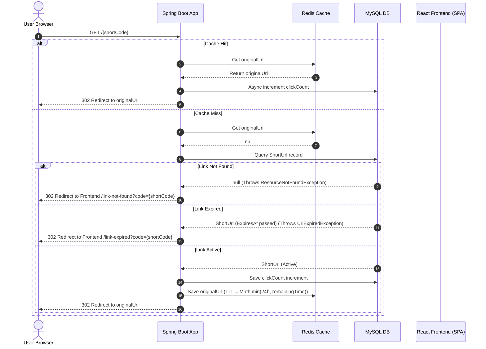

# Shortify

> A full-stack URL Shortener & Analytics Platform built with Spring Boot, React, Redis, Docker, and JWT Authentication.

[](https://github.com/arnav-jagetiya/url-shortener/actions/workflows/ci.yml)
[](LICENSE)
[](docs/setup/setup.md)
[](docs/engineering-decisions/engineering-decisions.md)
[](docs/setup/setup.md)
[](docs/architecture/architecture.md)

Shortify is a URL shortener and analytics platform consisting of a Java Spring Boot REST API backend and a Vite React SPA client dashboard, containerized via Docker for reliable local development and deployment.

---

## Why this project?

Shortify was built as a portfolio project to explore the engineering challenges involved in designing a scalable URL shortening service.

Rather than focusing only on functionality, the project emphasizes clean architecture, maintainability, API design, security, caching, documentation, and engineering best practices.

The project emphasizes:
- Layered Architecture
- Stateless JWT Authentication
- Redis Cache-Aside Caching
- RESTful API Design
- Dockerized Development
- Clean Repository Organization

It also serves as a practical implementation of the Engineering Playbook v1.0, applying engineering principles across architecture, API design, documentation, Git workflows, and maintainability.

---

## Key Features

* **Cache-Aside Redirection**: The platform uses a Redis Cache-Aside strategy to reduce database reads and improve URL redirection performance while keeping MySQL as the system of record.
* **Stateless JWT Security**: Secure, stateless user authentication with JSON Web Tokens. Protected URL management endpoints require JWT authorization headers.
* **Interactive Metrics Dashboard**: Responsive frontend UI displaying total URL metrics, click metrics, active/expired statuses, copy actions, and search filtering.
* **Browser Redirection Flow**: Custom HTTP redirection logic routing expired links (HTTP 410) and missing codes (HTTP 404) to custom branded React error pages.
* **Containerized Infrastructure**: Fully containerized environment orchestrating frontend, backend, MySQL, and Redis services for immediate runtime setup.

---

## Technology Stack

| Layer | Technologies |
| :--- | :--- |
| **Frontend** | React, TypeScript, Tailwind CSS, React Router, Axios |
| **Backend** | Spring Boot, Spring Security, Spring Data JPA, Hibernate, JWT |
| **Databases** | MySQL 8.0 (Persistent storage), Redis 7.0 (In-memory caching) |
| **DevOps & CI** | Docker, Docker Compose, GitHub Actions |

---

## System Architecture

Shortify implements a decoupled client-server architecture. Browser redirect links are intercepted and resolved by the Spring Boot server (checking cache first, then database), while users create and monitor URLs inside a secure React client application.



*For more details on the cache eviction strategies and component roles, see [ARCHITECTURE.md](docs/architecture/architecture.md).*

---

## Getting Started

### Quick Start
To launch the entire stack using Docker Compose:
```bash
docker compose up -d --build
```
* **Frontend Dashboard**: `http://localhost:5173`
* **Swagger API Reference**: `http://localhost:8080/swagger-ui/index.html`
* **Actuator Health check**: `http://localhost:8080/actuator/health`

*Detailed setup instructions, prerequisite installations, and manual local development run configurations are documented in [SETUP.md](docs/setup/setup.md).*

---

## Project Structure

```
.
├── .github/workflows/          # GitHub Actions CI pipeline
│   └── ci.yml                  # CI build configuration
├── assets/                     # Static repository assets (logos, diagrams)
├── docs/                       # Modular project documentation
│   ├── api/                    # Endpoint payloads & response structures
│   │   └── api-specification.md
│   ├── architecture/           # Sequence flows & component design
│   │   └── architecture.md
│   ├── engineering-decisions/  # Technical rationale & tradeoffs
│   │   └── engineering-decisions.md
│   └── setup/                  # Environment config & run instructions
│       └── setup.md
├── frontend/                   # React SPA client application
│   ├── src/                    # Components, pages, hooks, contexts
│   └── package.json            # Node.js dependencies & scripts
├── src/                        # Spring Boot Java source code
│   └── main/java/com/arnav/    # Layered Spring Boot application packages
├── Dockerfile                  # Multi-stage Docker build config
├── docker-compose.yml          # Container stack orchestration config
├── pom.xml                     # Maven project configuration
├── README.md                   # Repository landing page
├── LICENSE                     # MIT License
├── CHANGELOG.md                # Project changelog
└── VERSION                     # Current project SemVer version
```

---

## Documentation

* **[Architecture Guide](docs/architecture/architecture.md)**: Diagrams showing requests flows, Redis synchronization, and authentication interceptors.
* **[API Reference](docs/api/api-specification.md)**: Specific contract payloads, HTTP headers, status code meanings, and redirect parameters.
* **[Setup Manual](docs/setup/setup.md)**: Development configuration instructions and troubleshooting guidelines.
* **[Engineering Decisions Record](docs/engineering-decisions/engineering-decisions.md)**: Architectural rationales behind Spring Boot, React, Redis, JWT, and Docker selections.

---

## Screenshots

Application screenshots will be added after deployment.

Planned screenshots include:
- Landing Page
- Authentication
- Dashboard
- URL Creation
- Analytics
- Mobile View

---

## Roadmap

The following enhancements are planned for future releases and are not part of the current implementation:
* **Analytics Reporting**: Implement geolocation, device metrics, and browser breakdown charts in the dashboard UI.
* **Domain Restrictions**: Implement domain blocklists and validate destination IP addresses to prevent phishing redirection abuse.
* **Custom URL Expirations**: Expand backend configuration to allow selecting custom dates and dynamic minutes-to-live metrics directly.
* **Automated Integration Tests**: Configure Testcontainers inside GHA to validate Redis cache evictions and Spring Security filters.

---

## License

This project is licensed under the MIT License. See [LICENSE](LICENSE) for the full text.

---

## Author

**Arnav Jagetiya**
* **GitHub**: [@arnav-jagetiya](https://github.com/arnav-jagetiya)
