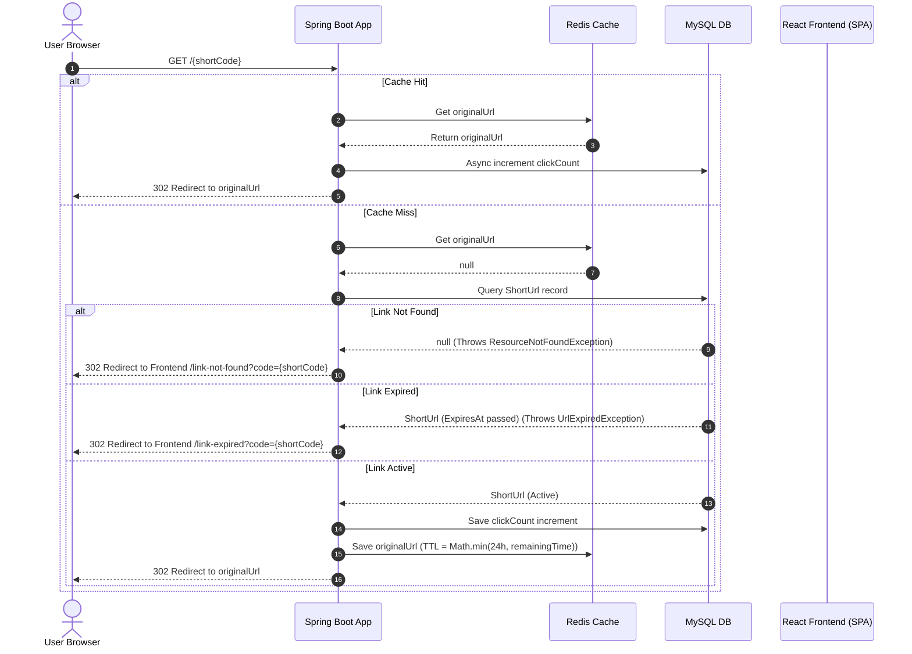

# System Architecture

This document describes the design, components, and caching flow of the Shortify platform.

---

## Design Goals

The design of the Shortify platform is guided by the following goals:
* **Separation of Concerns**: Maintaining a clear boundary between the presentation layer (React frontend) and business logic (Spring Boot backend).
* **Predictable API Contracts**: Establishing explicit REST API endpoints with structured JSON request/response formats.
* **Performance through Caching**: Minimizing relational database load by serving active redirections from memory.
* **Scalability & Statelessness**: Eliminating server-side session states to allow independent horizontal scaling.
* **Maintainability**: Structuring both backend packages and frontend components logically to allow modular extensions.

---

## Technology Stack

### Frontend
* **React** (Component-based user interface)
* **TypeScript** (Static type safety)
* **Tailwind CSS** (Utility-first styling framework)
* **React Router** (Client-side routing & page guards)
* **Axios** (HTTP client)

### Backend
* **Spring Boot** (MVC microservice framework)
* **Spring Security & JWT** (Stateless authentication middleware)
* **Spring Data JPA** (MySQL persistence mapping)
* **Redis** (In-memory lookup caching)
* **MySQL** (Relational storage)

### Infrastructure
* **Docker & Docker Compose** (Containerized dependencies & runs)
* **GitHub Actions** (Automated CI pipelines)

---

## System Design Overview

Shortify uses a decoupled architecture where the user browser navigates through redirect links handled by the backend server, and manages links through a React dashboard.

### Request Lifecycle Summary

* **Redirection Lookup**: The browser triggers a `GET` request to `/{shortCode}`.
* **Cache Validation**: The backend checks for the key in Redis cache. If present (Cache Hit), it asynchronously schedules a click count database increment and redirects immediately.
* **Database Fallback**: If missing in cache (Cache Miss), the backend queries the MySQL database.
* **Exception Redirections**: If the code does not exist or has expired in MySQL, the backend throws an exception centrally handled to redirect the browser to the React `/link-not-found` or `/link-expired` routes.
* **Cache Population**: For active links, the backend records the click increment, caches the destination URL in Redis with a remaining-time TTL, and redirects the browser to the target site.

---

## System Components

### 1. Frontend Client (React SPA)
* **State Management**: React Context (`AuthContext` and `ToastContext`) manages global session authentication states and alerts.
* **Routing**: React Router handles protected dashboard access via the `ProtectedRoute` route guard and serves custom branded public error routes (`/link-expired`, `/link-not-found`).
* **API Client**: A centralized Axios client (configured via `import.meta.env.VITE_API_BASE_URL`) attaches session JWT bearer tokens to outbound REST requests.

### 2. Backend Server (Spring Boot)
* **Controller Layer**: Exposes REST interfaces (`AuthController`, `UrlController`) and handles browser short URL lookups (`RedirectController`).
* **Service Layer**: Coordinates business operations (URL creation, expiration calculation, token mapping).
* **Repository Layer**: Uses Spring Data JPA to write and query persistent entities from the MySQL database.
* **Security Middleware**: Spring Security handles password hashing (BCrypt) and intercepts incoming requests to validate JWT signatures.

---

## Cache-Aside Caching Strategy

To support high-concurrency redirection lookups without exhausting database resources, Shortify implements the **Cache-Aside Pattern**:
1. **Redirection checks**: Lookups check Redis first before falling back to MySQL.
2. **TTL Expiration Sync**: When a link with an expiration date is loaded from MySQL during a cache miss, the backend calculates the remaining seconds to expiry and sets it as the Redis cache key TTL (`Math.min(24_hours, secondsToExpiry)`). This ensures the Redis key naturally evicts from the cache the exact millisecond the URL expires, avoiding stale cache redirects.
3. **Write Isolation**: Cache eviction is automatically triggered during URL deletion to maintain database consistency.

> [!IMPORTANT]
> The Redis cache acts purely as an optimization layer for read throughput. The MySQL relational database remains the single source of truth for URL mappings, expirations, and user profiles.

---

## Authentication Flow

Authentication is stateless and managed via JSON Web Tokens (JWT):
1. **Authentication**: Users log in (`POST /api/auth/login`) or register (`POST /api/auth/register`) to receive a signed JWT.
2. **Token Storage**: The client saves the token inside `localStorage`.
3. **Interceptor Filtering**: A custom JWT authentication filter intercepts incoming request headers, validates the signature, extracts the user profile, and registers the session inside Spring's `SecurityContextHolder`.

> [!NOTE]
> Authentication is entirely stateless. The server does not maintain session state (such as sessions in Redis or memory) between requests; every API request must present a valid signed JWT bearer token.

---

## Architecture Principles

Shortify adheres to the following key design principles:
* **Separation of Concerns**: Decoupled browser UI representation from backend database transaction lookups.
* **Layered Architecture**: Strict controller-service-repository hierarchy in Java.
* **Cache-Aside Pattern**: Safe in-memory lookups keeping MySQL query queues small.
* **Stateless Authentication**: Token-based security requiring no server sessions.
* **Explicit API Contracts**: Type-enforced inputs and uniform JSON payloads.
* **Single Source of Truth**: MySQL database controls actual record status, while Redis serves as a transient caching layer.
